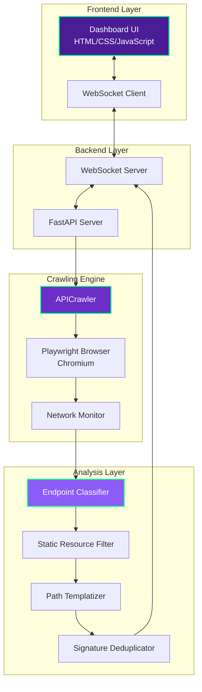
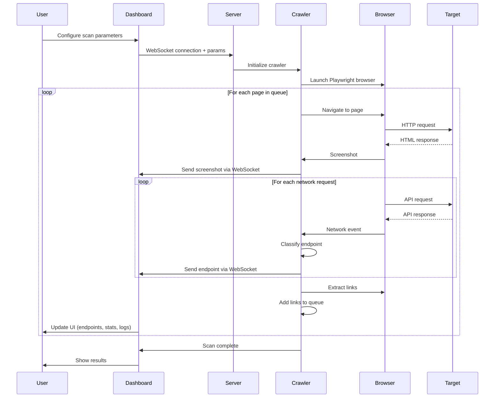
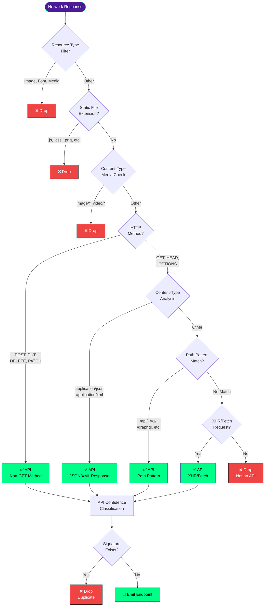
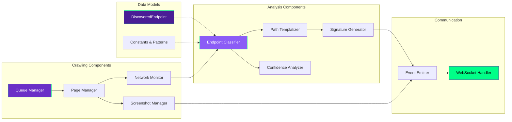

# 👀 Peekaboo Project
### *Revealing Hidden APIs in Plain Sight*

```
    👁️  👁️
     \  /
      \/
   🔍 API Discovery Scanner
```

A real-time visual API discovery tool that crawls web applications and automatically identifies REST API endpoints by monitoring network traffic and analyzing application behavior.

**Peekaboo** - *noun*: A game of hiding and revealing. Just like the childhood game, our scanner peeks behind the curtains of web applications to reveal hidden API endpoints that weren't meant to be found.

## Overview

The Peekaboo Project is designed for security researchers, API developers, and QA teams who need to discover and document undocumented APIs in web applications. Instead of relying solely on static analysis or path enumeration, it takes a behavioral approach by actually loading pages in a real browser and observing network traffic - revealing what's hiding in plain sight.

## Key Features

### 🔍 **Intelligent API Detection**
- **Content-Type Analysis**: Identifies APIs by analyzing response headers (`application/json`, `application/xml`, etc.)
- **Path Pattern Matching**: Detects common API patterns (`/api/`, `/v1/`, `/graphql`, etc.)
- **Network Traffic Monitoring**: Captures XHR/Fetch requests that indicate API communication
- **Smart Filtering**: Automatically excludes static resources (images, CSS, JS, fonts, etc.)

### 🎯 **Classification System**
- **API**: Confirmed APIs (JSON/XML responses, API path patterns)
- **Maybe API**: Ambiguous endpoints (form data, multipart uploads)
- **Not API**: Regular web pages and static resources

### 📊 **Real-Time Visualization**
- **Live Screenshot Feed**: Visual confirmation of what pages are being crawled
- **Activity Log**: Detailed timeline of discovery events
- **Statistics Dashboard**: Track endpoints, pages, hosts, and queue status
- **Interactive Table**: Filter, sort, and analyze discovered endpoints

### 🎨 **Advanced Filtering**
- **Domain Filters**: Subdomain vs External API separation
- **Method Filters**: Filter by HTTP method (GET, POST, PUT, DELETE, etc.)
- **API Type Filters**: View only confirmed APIs, maybe APIs, or non-APIs
- **Status Code Filters**: Filter by response status (2xx, 3xx, 4xx, 5xx)
- **Text Search**: Quick search across method, path, and host

### ⚡ **Performance Features**
- **Concurrent Crawling**: Process multiple pages in parallel
- **Pause/Resume**: Pause UI updates while scan continues in background
- **Pagination**: Handle large result sets (50 endpoints per page)
- **Path Templatization**: Deduplicate similar endpoints by replacing IDs with templates

### 🛡️ **Stealth Capabilities**
- **Browser Fingerprint Evasion**: Masks automation signals
- **Proxy Support**: Route traffic through HTTP proxies (supports authentication)
- **Custom User-Agents**: Configurable browser identification
- **Rate Limiting**: Respect target application resources

## Architecture

### System Overview



### Crawling Workflow



### API Detection Flow



### Component Architecture



## How It Works

### 1. Browser Automation
Visual API Crawler uses **Playwright** to control a real Chromium browser instance. This provides several advantages:
- **JavaScript Execution**: Modern SPAs are fully rendered
- **Network Interception**: All HTTP traffic is captured
- **DOM Interaction**: Can extract links and crawl deeper
- **Screenshot Capability**: Visual verification of crawled pages

### 2. Network Traffic Analysis
Every network request made by the browser is intercepted and analyzed:
- **Request Metadata**: Method, URL, headers, resource type
- **Response Analysis**: Status code, Content-Type, payload
- **Timing Information**: Request/response timing for performance analysis

### 3. Endpoint Classification
The classifier uses multiple signals to determine if a request is an API:

**High Confidence Indicators:**
- Returns `application/json` or `application/xml`
- Non-GET HTTP methods (POST, PUT, DELETE, PATCH)
- Path contains API patterns (`/api/`, `/v\d+/`, `/graphql`)
- XHR/Fetch requests returning structured data

**Medium Confidence Indicators:**
- Form submissions (`application/x-www-form-urlencoded`)
- Multipart uploads (`multipart/form-data`)
- XHR/Fetch requests without clear content type

### 4. Deduplication Strategy
To avoid redundant entries, the system uses **signature-based deduplication**:

```
Signature = HTTP_METHOD | HOST | TEMPLATIZED_PATH
Example: GET|api.example.com|/users/{id}/posts/{id}
```

**Path Templatization** replaces variable segments:
- UUIDs → `{uuid}`
- MongoDB ObjectIDs → `{objectId}`
- Numeric IDs → `{id}`
- Long tokens → `{token}`

This ensures `/users/123/posts/456` and `/users/789/posts/012` are recognized as the same endpoint pattern.

### 5. Real-Time Updates
All discoveries are streamed to the dashboard via **WebSocket**:
- **Endpoints**: As soon as they're discovered
- **Screenshots**: After each page load
- **Logs**: Activity updates and errors
- **Statistics**: Running totals and queue status

## 🚀 Installation

### Prerequisites
- **Python 3.8+**
- **pip** package manager
- **Playwright** browsers (installed automatically)

### Setup

```bash
# Clone the Peekaboo Project
git clone <repository-url>
cd visual_crawler

# Install dependencies
pip install -r requirements.txt

# Install Playwright browsers (for the peeking!)
playwright install chromium

# Launch Peekaboo
python main.py
```

The Peekaboo dashboard will open automatically at `http://localhost:8187` 👀

## Usage

### Basic Scan

1. **Enter Target Domain**: `example.com` (without http/https)
2. **Configure Options** (optional):
   - Max Pages: Number of pages to crawl
   - Max Depth: Link depth from start page
   - Timeout: Per-page timeout in milliseconds
3. **Click "Start Scan"**
4. **Monitor Progress**: Watch live screenshots and endpoint discoveries
5. **Filter Results**: Use domain, method, API type, and status filters
6. **Export Data**: Copy endpoint data for documentation or testing

### Advanced Configuration

**Include Subdomains**: Crawl `api.example.com`, `www.example.com`, etc.

**API Filter**:
- **All**: Show all discovered endpoints
- **Subdomain**: Only show APIs on target domain/subdomains
- **External**: Only show third-party APIs

**Concurrent Pages**: Process multiple pages simultaneously (default: 5)

**Fast Mode**: Skip screenshots for faster scanning

### Proxy Configuration

Set environment variables before running:

```bash
export PROXY_HOST="proxy.example.com"
export PROXY_PORT="8080"
export PROXY_USER="username"
export PROXY_PASS="password"

python main.py
```

Useful for:
- **Corporate proxies**: Route through company infrastructure
- **Residential proxies**: Bypass IP-based rate limiting
- **Debugging**: Inspect traffic in proxy tools (Burp, ZAP)

### Pause/Resume

**Pause Scan**: Stops UI updates while crawling continues in background
- Useful for: Reducing CPU load, letting scan complete faster
- Resume shows all accumulated data at once

**Terminate Scan**: Stops crawling immediately and closes browser

## Technical Stack

### Backend
- **Python 3.8+**: Core language
- **FastAPI**: Async web framework and WebSocket server
- **Playwright**: Browser automation and network monitoring
- **Uvicorn**: ASGI server for FastAPI

### Frontend
- **HTML5/CSS3**: Modern, responsive UI
- **Vanilla JavaScript**: No framework dependencies
- **WebSocket API**: Real-time bidirectional communication
- **CSS Grid/Flexbox**: Responsive layout system

### Browser Automation
- **Chromium**: Headless browser via Playwright
- **Network Interception**: CDP (Chrome DevTools Protocol)
- **Screenshot Capture**: JPEG with quality optimization

## Use Cases

### Security Research
- **API Surface Discovery**: Find all exposed APIs in a target application
- **Undocumented Endpoints**: Discover APIs not mentioned in documentation
- **Third-Party Tracking**: Identify external APIs and data leakage
- **Attack Surface Mapping**: Understand application architecture

### API Development
- **Documentation Generation**: Auto-discover endpoints for documentation
- **API Inventory**: Maintain catalog of microservices and endpoints
- **Version Detection**: Identify API versioning patterns
- **Endpoint Coverage**: Ensure all APIs are tested

### Quality Assurance
- **Integration Testing**: Verify API calls during user workflows
- **Performance Analysis**: Monitor API response times and status codes
- **Regression Testing**: Detect new/changed/removed endpoints
- **Cross-Browser Testing**: Verify API behavior across browsers

### Compliance & Governance
- **Data Flow Analysis**: Track where data is sent (GDPR, CCPA)
- **External Dependencies**: Audit third-party API usage
- **API Policy Enforcement**: Verify APIs follow organizational standards
- **Shadow IT Detection**: Discover unauthorized API integrations

## Configuration Reference

### Scan Parameters

| Parameter | Type | Default | Description |
|-----------|------|---------|-------------|
| `domain` | string | required | Target domain (without protocol) |
| `max_pages` | integer | 50 | Maximum pages to crawl |
| `max_depth` | integer | 3 | Maximum link depth from start page |
| `timeout` | integer | 30000 | Page load timeout (milliseconds) |
| `include_subdomains` | boolean | true | Include subdomain APIs |
| `api_filter` | string | "all" | API filter: all, subdomain, external |
| `concurrent_pages` | integer | 5 | Parallel page processing |
| `fast_mode` | boolean | false | Skip screenshots for speed |

### Static Resource Extensions

The following extensions are automatically excluded:

**Documents**: `.json`, `.xml`, `.txt`, `.pdf`
**Scripts**: `.js`, `.map`
**Styles**: `.css`, `.woff`, `.woff2`, `.ttf`, `.eot`, `.otf`
**Images**: `.png`, `.jpg`, `.jpeg`, `.gif`, `.svg`, `.ico`, `.webp`, `.bmp`, `.tiff`, `.avif`, `.apng`
**Media**: `.mp4`, `.webm`, `.avi`, `.mov`, `.mp3`, `.wav`, `.ogg`, `.flac`
**Archives**: `.br`, `.gz`
**Other**: `.webmanifest`

### API Path Patterns

Automatically detected patterns:

- `/api/` - Standard API prefix
- `/v\d+/` - Versioned APIs (v1, v2, etc.)
- `/graphql` - GraphQL endpoints
- `/rest/` - REST API prefix
- `/rpc/` - RPC endpoints
- `/gateway/` - API gateway paths
- `/service/` - Microservice endpoints
- `/ajax/` - AJAX request paths

## Performance Considerations

### Crawling Speed
- **Concurrent Pages**: Higher values = faster crawling but more resources
- **Timeout**: Lower values = faster failures but might miss slow pages
- **Fast Mode**: Disable screenshots for 30-50% speed improvement

### Memory Usage
- **Browser Instances**: Each concurrent page uses ~100-200MB RAM
- **Endpoint Storage**: Minimal (few KB per endpoint)
- **Screenshot Cache**: JPEG compressed to ~50-100KB each

### Network Traffic
- **Bandwidth**: Depends on target site (images, media)
- **Request Rate**: Controlled by concurrent pages and timeout
- **Proxy Overhead**: Additional latency if using proxies

## Troubleshooting

### Bot Detection / 403 Errors
- Enable proxy support (residential proxies work best)
- Reduce concurrent pages to appear less aggressive
- Increase timeout to avoid retry storms
- Some sites (Akamai, Cloudflare) may still block automation

### Hanging Scans
- Per-page timeout prevents indefinite hangs
- Check target site isn't legitimately slow
- Reduce concurrent pages if system resources are limited

### Missing APIs
- Ensure "Include Subdomains" is enabled for cross-domain APIs
- Check Domain filter isn't hiding external APIs
- Some SPAs require user interaction to trigger API calls
- APIs loaded after scroll/click may not be discovered

### High Memory Usage
- Reduce concurrent pages
- Enable fast mode (disable screenshots)
- Reduce max_pages to limit crawl scope

## 🤝 Contributing

Contributions to the Peekaboo Project are welcome! Areas for improvement:

- **Authentication Support**: Handle login flows for authenticated API discovery
- **Custom Headers**: User-defined request headers
- **Export Formats**: OpenAPI/Swagger export
- **Recursive Crawling**: Follow API links in responses
- **Rate Limiting**: Configurable request delays
- **Session Management**: Maintain login sessions across pages
- **More Peekaboo Magic**: Suggest new ways to reveal hidden APIs!

## 📜 License

[Specify your license here]

## 🙏 Acknowledgments

Built with love and curiosity by the Salt Security team:
- [Playwright](https://playwright.dev/) - Browser automation (for the peeking)
- [FastAPI](https://fastapi.tiangolo.com/) - Web framework
- [Uvicorn](https://www.uvicorn.org/) - ASGI server
- [AWS Bedrock](https://aws.amazon.com/bedrock/) - AI-powered API analysis

---

## 🎭 Why "Peekaboo"?

The name captures the essence of what this tool does:
- **Peek** - Observes web applications in action, watching network traffic
- **Boo** - Surprises you with APIs you didn't know existed
- **Playful** - Makes API discovery fun and interactive
- **Revealing** - Uncovers hidden endpoints that aren't documented

Just like in the game, we're constantly looking for what's hidden, and when we find it - *Peekaboo! I see you!* 👀

---

**🔐 Salt Security x Peekaboo Project**
*Discover APIs visually, analyze thoroughly, document automatically.*

```ascii
   _______________
  |  _________  |
  | |  👁️   👁️  | |
  | |    ▼    | |
  | |  \___/  | |
  | |_________| |
  |_____________|

  "I found your APIs!"
```
